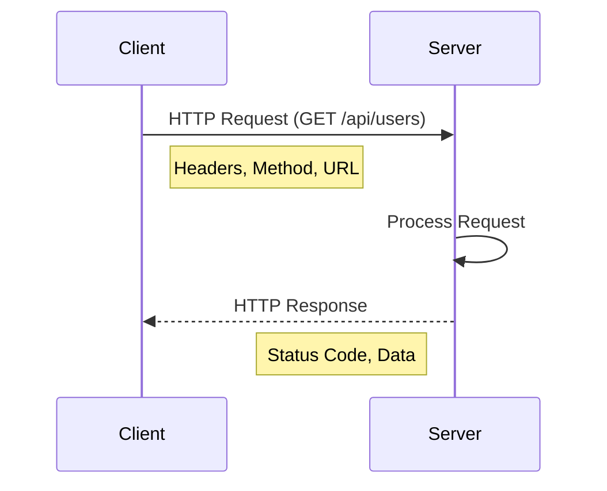
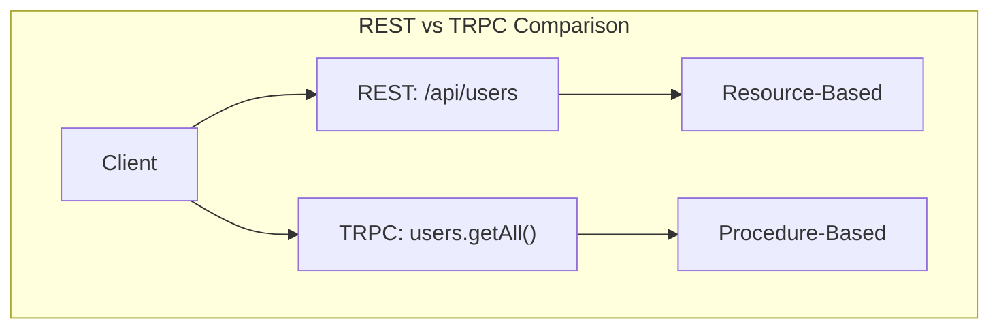
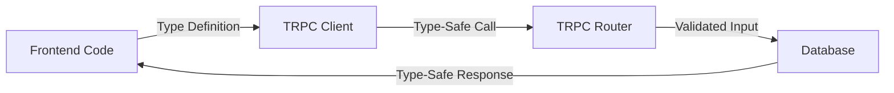
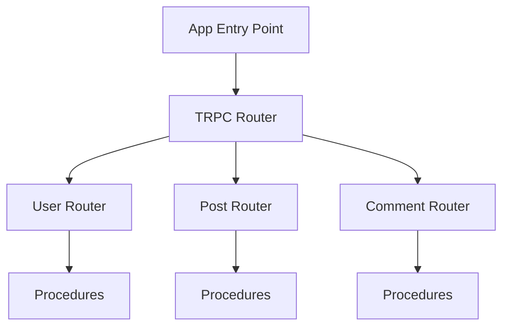
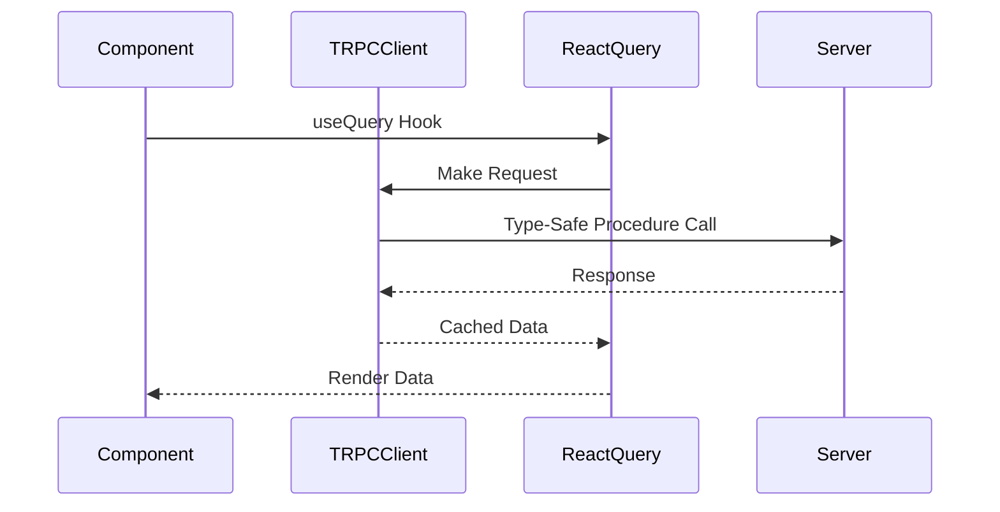
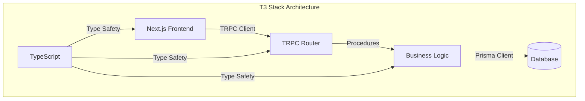

# From HTTP to TRPC: A Complete Guide to Frontend-Backend Communication in the T3 Stack

## Introduction

Before diving into the T3 stack's modern approach to frontend-backend communication, it's essential to understand the evolution of web APIs and why type-safe RPC (Remote Procedure Call) has become increasingly important. This tutorial bridges fundamental concepts with modern implementations, showing how the T3 stack solves traditional API challenges.

### Prerequisites
- Basic Next.js knowledge
- TypeScript fundamentals
- Node.js environment

### Learning Outcomes
- Understand HTTP and API fundamentals
- Master TRPC implementation
- Build type-safe full-stack features

## Table of Contents
1. Foundational Concepts
2. Understanding Backend Communication
3. Setting Up TRPC
4. Frontend Integration
5. Practical Implementation

## 1. Foundational Concepts

### HTTP Protocol Basics

HTTP is the foundation of data communication on the web. Here's how it works:



#### Key HTTP Components:
```plaintext
HTTP Request Structure:
1. Method (GET, POST, PUT, DELETE)
2. Headers (metadata)
3. URL (endpoint)
4. Body (data payload)

Common Status Codes:
200: Success
201: Created
400: Bad Request
404: Not Found
500: Server Error
```

### REST vs RPC Architecture



#### REST Example:
```typescript
// REST Endpoints
GET    /api/users        // Get all users
POST   /api/users        // Create user
GET    /api/users/:id    // Get specific user
PUT    /api/users/:id    // Update user
DELETE /api/users/:id    // Delete user
```

#### TRPC Example:
```typescript
// TRPC Procedures
users.getAll()
users.create({ name: "John" })
users.getById("123")
users.update({ id: "123", name: "John" })
users.delete("123")
```

## 2. Understanding Backend Communication

### Type Safety Flow



### Traditional REST Implementation

```typescript
// API Types
interface User {
  id: string;
  name: string;
  email: string;
}

// API Endpoint
app.get('/api/users/:id', async (req, res) => {
  try {
    const user: User = await db.users.findUnique({
      where: { id: req.params.id }
    });
    res.json(user);
  } catch (error) {
    res.status(500).json({ error: 'Failed to fetch user' });
  }
});
```

### TRPC Implementation

```typescript
// Backend Router Definition
export const userRouter = createTRPCRouter({
  getById: publicProcedure
    .input(z.string())
    .query(async ({ input }) => {
      const user = await prisma.user.findUnique({
        where: { id: input }
      });
      if (!user) throw new TRPCError({
        code: 'NOT_FOUND',
        message: 'User not found'
      });
      return user;
    })
});
```

## 3. Setting Up TRPC

### Router Architecture



### Error Handling and Validation

```typescript
const createUserSchema = z.object({
  name: z.string().min(2).max(50),
  email: z.string().email(),
  age: z.number().min(13).optional()
});

export const userRouter = createTRPCRouter({
  create: publicProcedure
    .input(createUserSchema)
    .mutation(async ({ input, ctx }) => {
      try {
        return await prisma.user.create({
          data: input
        });
      } catch (error) {
        if (error.code === 'P2002') {
          throw new TRPCError({
            code: 'CONFLICT',
            message: 'Email already exists'
          });
        }
        throw error;
      }
    })
});
```

## 4. Frontend Integration

### Data Flow Pattern



### Advanced Query Patterns

```typescript
export function UserDashboard() {
  // Parallel queries
  const [users, posts] = api.useQueries(trpc => [
    trpc.user.getAll(),
    trpc.post.getByUser({ userId: "123" })
  ]);

  // Infinite loading
  const { data, fetchNextPage, hasNextPage } = 
    api.post.infiniteList.useInfiniteQuery(
      { limit: 10 },
      { getNextPageParam: (lastPage) => lastPage.nextCursor }
    );
}
```

## 5. Practical Implementation

### Full Stack Architecture



### Complete Example: Comment System

```typescript
// Router definition
export const commentRouter = createTRPCRouter({
  getThread: publicProcedure
    .input(z.string())
    .query(async ({ input }) => {
      return prisma.comment.findMany({
        where: { postId: input },
        include: {
          author: true,
          replies: {
            include: { author: true }
          }
        },
        orderBy: { createdAt: 'desc' }
      });
    }),
});

// Frontend implementation
export function CommentSection({ postId }: { postId: string }) {
  const comments = api.comment.getThread.useQuery(postId);
  
  return (
    <div>
      <CommentForm onSubmit={(content) => 
        addComment.mutate({ postId, content })}
      />
      <CommentList 
        comments={comments.data}
        isLoading={comments.isLoading}
      />
    </div>
  );
}
```
